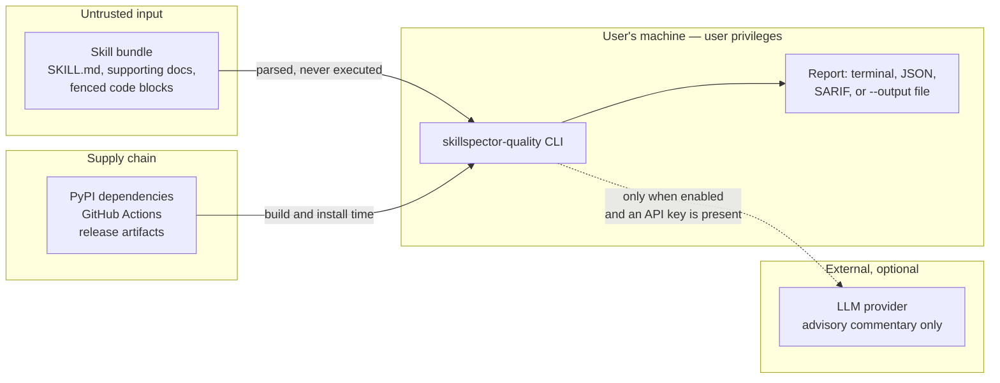

# Assurance case

An assurance case is an argument, backed by evidence, that the software is adequately secure for
what it does. This one is deliberately narrow: it states what the tool is trusted to do, where
the trust boundaries are, what could go wrong, and what evidence supports each claim — including
the risks that are **accepted rather than mitigated**.

Scope: the `skillspector-quality` package and its release pipeline. Upstream `skillspector` has
its own posture and is treated here as a dependency.

## What the software does

A command-line tool that reads a skill bundle (`SKILL.md` plus supporting files) from the local
filesystem and emits a deterministic 0–100 quality score, a token-cost estimate, and a merged
security report from upstream. It is a **read-and-report** tool: it analyses files, it does not
run them.

## Trust boundaries

Four boundaries matter:

1. **Skill bundle → scorer.** The primary boundary. Content is fully attacker-controlled if a
   user scores a bundle from an untrusted source.
2. **Scorer → LLM provider.** Crossed *only* when commentary is enabled and an API key is
   present. Skill content leaves the machine at this point.
3. **Supply chain → build.** Dependencies, GitHub Actions, and published artifacts.
4. **Scorer → filesystem.** The tool writes only where the user points `--output`.

## Security claims and evidence

| # | Claim | Evidence |
|---|-------|----------|
| C1 | Analysing a malicious skill bundle does not execute attacker code | No `eval`, `exec`, `pickle`, `subprocess`, or `os.system` anywhere in `src/` — verifiable by grep and enforced by CodeQL. Python inside fenced code blocks is measured by `radon`, which analyses the AST and never runs it. |
| C2 | YAML frontmatter cannot instantiate arbitrary objects | `yaml.safe_load` is the only YAML entry point (`scorers.py`). `safe_load` refuses the tags that make `yaml.load` dangerous. |
| C3 | Parsing untrusted input does not crash the tool | The parser and the full scoring pipeline are fuzzed continuously with ClusterFuzzLite/atheris against `_parse_frontmatter` and `score_quality`, on every pull request. |
| C4 | Scoring requires no network access | No `requests`, `urllib`, `httpx`, or `socket` usage in `src/`. The score is deterministic and reproducible fully offline; `--no-llm` is not needed to keep it offline, it only suppresses optional commentary. |
| C5 | Skill content is not sent anywhere without the user's action | The only egress is optional LLM commentary, which requires both an explicit opt-in path and a configured API key. It is advisory: it attaches prose notes and never changes a number. |
| C6 | Released binaries are attributable and tamper-evident | Release artifacts are signed with Sigstore keyless signing using the release workflow's OIDC identity, and published with `SHA256SUMS`. Verification is documented in [RELEASING.md](../RELEASING.md). |
| C7 | The build cannot silently pull unreviewed code | Every GitHub Action is pinned by commit SHA, not a mutable tag. The fuzzing image is pinned by digest and its Python dependencies install under `pip --require-hashes`. Dependencies are locked in `uv.lock`. |
| C8 | CI has least privilege | Workflows declare `permissions: contents: read` by default, raising to `contents: write` only in the release publish job and `security-events: write` for scanners. Checkouts use `persist-credentials: false`, so a compromised build step cannot reuse the checkout token. |
| C9 | Known-vulnerable dependencies are noticed | Dependabot watches four ecosystems weekly (two pip manifests, docker, github-actions). CodeQL runs the extended `security-and-quality` suite on every push, every PR, and weekly. OpenSSF Scorecard runs on a schedule. |
| C10 | Vulnerability reports have a private channel and a response commitment | GitHub private vulnerability reporting is enabled; [SECURITY.md](../SECURITY.md) documents the process and a 7-day response commitment. |

## Threats considered

**Malicious skill bundle attempting code execution.** Addressed by C1 and C2. The tool has no
execution path: no dynamic evaluation, no deserialisation of untrusted data, no shelling out.

**Malicious skill bundle causing denial of service.** Partially addressed by C3. Continuous
fuzzing exercises the parser and scorer against adversarial input and would surface crashes and
hangs. See *Accepted risks* for the residual.

**Supply-chain compromise of a dependency or action.** Addressed by C7 and C9. SHA-pinning means
a compromised upstream tag does not change this build; hash-pinned fuzzing requirements mean a
substituted artifact fails the build rather than entering the image.

**Tampered release artifact.** Addressed by C6. A consumer can verify both the digest and the
signature, and the signature ties the artifact to this repository's workflow identity rather
than to a personal key that could be stolen or lost.

**Compromised CI job escalating.** Addressed by C8. Default-read permissions and
non-persisted credentials limit what a malicious step can reach.

**Unintended disclosure of proprietary skill content.** Addressed by C5. Scoring is offline;
the single egress path is optional and requires a deliberately configured key. Calibration over
a private corpus is designed for this too: `benchmarks/calibrate.py` emits aggregate statistics
only — no skill name, path, or text — so a corpus report is publishable.

## Accepted risks

Stated rather than mitigated, so a reader can judge them:

- **Regular-expression complexity is not formally analysed.** Scoring uses many regexes over
  attacker-controlled text. Fuzzing exercises them, but no explicit ReDoS analysis has been
  performed. A crafted input causing pathological backtracking is plausible. Impact is bounded:
  the tool is a short-lived local process, so the effect is a slow or hung analysis, not
  compromise.
- **Resource limits are not enforced.** There is no cap on input size or analysis time. A
  pathologically large bundle can consume memory and CPU. The tool runs with the invoking user's
  privileges and is not a service.
- **`--output` is not sandboxed.** The tool writes wherever the user points it, with the user's
  permissions. This is intended CLI behaviour, not a boundary.
- **Upstream `skillspector` is trusted.** Its security findings are merged into the report. Its
  posture is out of scope here; the dependency is pinned to an exact version.
- **Bus factor of 1.** One maintainer receives and fixes vulnerability reports, so response
  depends on one person's availability. Recorded in
  [GOVERNANCE.md](../GOVERNANCE.md#continuity-of-access) with the fallback, and on
  [ROADMAP.md](../ROADMAP.md) as an open goal.
- **Git tags are not yet signed.** Release *artifacts* are signed (C6); the `v*` tags themselves
  are not, which is a gap between the repository and the artifact. Tracked in
  [RELEASING.md](../RELEASING.md).

## Reviewing this document

This assurance case is reviewed at each major release, and whenever a change adds a new trust
boundary — in particular any new network call, any new deserialisation, or any new execution of
analysed content. Such a change should update this file in the same pull request.
